# Architecture

This document describes windbreak's process topology and order-flow path as
specified in SPEC §5 (Architecture) and as actually shipped today: four
isolated processes sharing only the ledger volume and localhost sockets, a
single order-flow path, and an import-boundary rule enforced by an
architectural test rather than convention alone.

## Component & trust topology (SPEC §5.1)

Process isolation is mandatory: killing one process must never kill another.
The four processes, adapted from the SPEC §5.1 diagram:

```mermaid
flowchart LR
  subgraph External
    EX[Exchange APIs]
    LLM[LLM Providers]
    WEB[Web research sources]
  end

  subgraph host [Local host]
    subgraph P_A [Process A: pipeline -- no trade credentials]
      MC[Market Connector] --> SCR[Screener]
      SCR --> FE[Forecast Engine]
      FE --> TS[Trade Selector]
    end
    subgraph P_B [Process B: Risk Kernel -- read-only creds + signing key]
      RK[[RISK KERNEL]]
    end
    subgraph P_C [Process C: Order Gateway -- trade-scope creds + verify key]
      OG[Order Gateway] --> REC[Reconciler]
    end
    subgraph P_D [Process D: Dashboard -- no exchange credentials]
      DASH[Dashboard + Alerts, 127.0.0.1]
    end
    LG[(Append-only hash-chained Ledger)]
  end

  TS -->|normalized order intents| RK
  RK -->|signed single-use approval tokens| OG
  OG <--> EX
  MC <--> EX
  RK -. independent read-only verification .-> EX
  FE <--> LLM
  FE <--> WEB
  P_A --> LG
  RK --> LG
  OG --> LG
```



`windbreak run --process <token>` stands in for exactly one of these four
processes per invocation; the four tokens are `pipeline`, `riskkernel`,
`order_gateway`, `dashboard` (the gateway token is underscore-separated to
match its Python package name). Each invocation stamps its token as the
`component` on every heartbeat and shutdown log line. See the README's
Deployment section for how docker-compose and systemd run all four as
genuinely separate services.

**Known gap.** There is no `windbreak run --process dashboard` wiring yet that
actually boots the HTTP dashboard server described below; today an operator
starts it directly via the library entry point
`windbreak.dashboard.app.create_server` (see `docs/RUNBOOK.md` for the exact
snippet). The `dashboard` process token still just idles with heartbeats.

## Credential boundaries (SPEC §5.2)

See [`SECURITY.md`](SECURITY.md) for the full per-process credential table and
how it is enforced structurally; it is not duplicated here.

## Single order-flow path (SPEC §5.3)

There is exactly one path an order can take from idea to ledgered terminal
state:

```text
market snapshot -> screen decision -> (triage) -> forecast record
-> selector decision -> normalized order intent
-> Risk Kernel checks -> capital reservation -> signed approval token
-> Order Gateway token verification -> exchange submission
-> ack/fill events -> reconciliation -> ledgered terminal state
```

## Import-boundary rule

SPEC §5.3 requires that only the Order Gateway package may import the
exchange order-submission client, and only the Risk Kernel package may import
the approval-token signing key handle. This is enforced by AST-based
architectural tests, not by convention:

- `tests/riskkernel/test_process_isolation.py` scans the whole tree for any
  import of the signing-key handle outside `windbreak.riskkernel`.
- `tests/architecture/test_import_boundaries.py` scans the whole tree for any
  import of the paper/live order-submission client outside
  `windbreak.order_gateway`/`windbreak.connector` (with a narrow, documented
  allowlist extension for the PAPER-mode composition root,
  `windbreak.scheduler`, which constructs a `PaperExchange` only inside its
  PAPER factory).

Both suites run as part of the ordinary pytest run `scripts/check-all.sh`
gates on, so a violating merge fails Gate 1, not just code review.

## Deployment

See the README's Deployment section for the docker-compose and systemd
skeletons that run the four processes as separate services; it is not
duplicated here.
