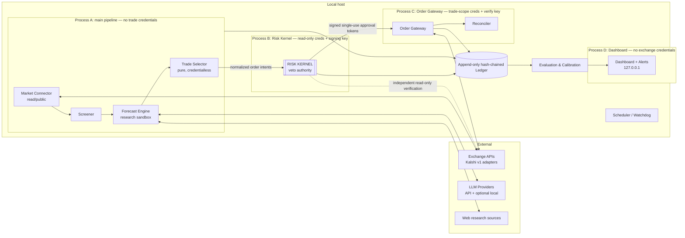

# SPEC_v3.md — Open-Source, Locally Hosted, Always-On AI Forecast Trader

**Codename:** `hedgekit`
**Status:** Draft v3.0 — implementation-ready, supersedes v1 and v2
**License target:** Apache-2.0
**Audience:** an autonomous coding agent (decomposition into epics/issues), plus maintainer, security reviewer, and operator.
**Primary design goal:** prove whether an AI-assisted forecasting pipeline has measurable edge, while making capital loss bounded, auditable, and deliberately boring. The default outcome should be humility: discovering *no durable edge* and stopping at paper trading is a success state of the design, not a failure of the software.

---

## 0. Provenance & Change Log

v3 is a synthesis. To prevent regressions during implementation, the origin of each major decision is recorded here; do not remove a mechanism without consulting this table.

**Adopted from v2:** credential-isolated Order Gateway as a third process; fixed-point integer numeric units; exchange balance-semantics contract; reduce-only close enforcement; jurisdiction/product eligibility as first-class data; three-track evaluation (forecast/selection/execution); selection-bias reporting; precommitted observation windows; clustered bootstrap over event groups; stronger promotion gates (300 resolved / 100 independent event groups); expanded documentation set; dashboard mutation allow/forbid lists; floor-lowering demotes to PAPER.

**Restored from v1 (dropped by v2, load-bearing):** the threat-model table driving the test plan; architecture diagram; guiding-principle tie-breakers; rationale prose on *why* mechanisms exist; explicit paper-fill pessimism model; milestone dependency graph; profit-sweep advisories; human-ack thresholds; glossary.

**Tightened vs. v2:** the promotion-gate loophole ("bootstrap CI excludes zero **or** flagged exploratory") is closed — significance is mandatory for live promotion, overrides are ledgered and mode-capped; `SELL_TO_CLOSE` contradiction resolved (close machinery is v1-mandatory for risk-off/kill; *strategy-driven* early exits remain post-v1).

**New in v3:** adverse-selection controls (order TTLs, cancel-on-move, cross-vs-rest policy); price-band limits and per-price-bucket calibration (favorite-longshot bias, fee curve); two-stage triage forecasting to protect the research budget; temporal-integrity rule (no backtests on resolved markets count toward gates — LLM training-data leakage); model version pinning + weekly canary set for silent-drift detection; pre-registered, hash-committed gate definitions (anti-Goodhart); ensemble-disagreement-scaled sizing; order-book participation caps; probability coherence across mutually exclusive outcomes; resolution-reversal handling; settlement-lag accounting; idle-cash-yield-adjusted hurdle; optional floor ratchet; mutation testing on safety-critical packages; adversarial market scenario suite.

---

## 1. Executive Summary

`hedgekit` is a local-first, always-on daemon that (1) screens prediction markets for questions where careful research can plausibly beat the crowd, (2) uses an LLM "superforecaster" scaffold to produce calibrated probability estimates with verified citations, (3) compares those estimates against live executable order books, and (4) may create order intents — none of which can reach an exchange unless approved by an independent, veto-holding **Risk Kernel** and submitted through a token-verifying, credential-isolated **Order Gateway**.

The design descends from publicly documented AI-forecasting pipelines (screen by volume → exclude information-disadvantaged categories → deep LLM research → trade only where forecast and executable price disagree beyond fees). It deliberately does **not** assume the headline results around those pipelines are reproducible: the widely cited "beating the market by 25%" figure was a *paper* portfolio with no commissions, borrow costs, or dividends; the "$35 → $2M" figure is a self-reported anecdote whose author states the edge is already competed away. Accordingly, v1's success metric is **demonstrated forecast calibration and provable capital safety**, not profit. Live trading is a privilege earned through gated promotion.

### 1.1 Non-negotiable product invariants

1. **Floor Invariant.** At all times, `worst_case_equity ≥ configured_floor`, computed conservatively (§10.4) from exchange-verified balances, open positions, open orders, pending approvals, fee upper bounds, and a reconciliation-uncertainty buffer. Enforced pre-trade, per order, by an independent process. If any input to this computation is unprovable, the system halts.
2. **Bounded-loss instruments only.** v1 trades only fully collateralized binary event contracts whose maximum loss is exactly known at order time. Margin, perps, leverage, shorting-to-open, options, equities, crypto spot/derivs, and borrowed funds are forbidden — not configurable — and the connector must refuse to normalize such products into tradeable instruments even if the exchange API exposes them.
3. **No trade credentials outside the Order Gateway.** Research, forecasting, screening, selection, dashboard, and the main daemon never possess trade-capable credentials. The Risk Kernel holds read-only credentials for independent verification. Withdrawal-capable credentials are forbidden system-wide; startup fails if detected.
4. **Evidence-gated autonomy.** `RESEARCH → PAPER → LIVE_MICRO → LIVE`, promotion by quantitative, *pre-registered* gates only; demotion and halting are automatic; the operator's `mode_ceiling` can never be exceeded by the system.
5. **Research/execution firewall.** Web content, model output, citations, and free-form rationale may influence only the probability fields of a forecast record — never config, credentials, routing, tool calls, limits, mode, or control flow.
6. **Temporal integrity.** Only forecasts made in real time, after deployment, on then-unresolved questions count toward any gate or headline metric. Backtests against historically resolved markets are forbidden as promotion evidence, because LLMs may know outcomes from training data.
7. **Append-only auditability.** Every snapshot, forecast, vote, decision, veto, approval, order transition, reconciliation, config change, and mode transition is written to a hash-chained ledger sufficient to reconstruct what the bot believed, why, what it tried to do, and what the exchange actually did.

### 1.2 Out of scope (v1)

Hosted/multi-user operation; automatic withdrawals or transfers; market making, HFT, or latency races; sports (blocked by default; unblocking requires explicit config plus a ledgered legal-risk acknowledgement); celebrity/insider-dependent markets; strategy-driven early exits (§9.8); portfolio optimization across non-whitelisted instruments; tax logic beyond record export.

---

## 2. Background & Design Rationale (read before decomposing)

**Why the floor is enforceable here and not elsewhere.** On fully collateralized binary exchanges (e.g., Kalshi, a CFTC-regulated US exchange), buying YES at price *p* risks exactly *p* per contract; buying NO risks *(1−p)*. There are no margin calls and no gap risk beyond total loss of stake. Worst-case portfolio value is therefore *exactly computable at order time*, turning the floor from a probabilistic stop-loss hope (equities gap through stops) into an arithmetic pre-trade check. This single fact drives the instrument whitelist and must not be "generalized away."

**Why fees and microstructure are first-class.** Exchange fees on binaries are typically proportional to `p·(1−p)` per contract and rounded up — brutal near 50¢, small at the extremes, but at the extremes the *percentage-of-stake* cost and favorite-longshot mispricing dominate. A 2–3 point gross edge can be fully consumed by fees plus slippage plus adverse selection. Every edge computation is therefore net-of-everything, from the executable book, never the midpoint.

**Why adverse selection is a named threat.** A resting limit order on an event market is a free option for anyone with faster news access: it fills predominantly when the world has just moved against it. A fundamentals bot must therefore prefer crossing the spread when edge is large, keep resting orders on short TTLs, and cancel on price movement (§9.7).

**Why the LLM cost model is part of the strategy.** Research-grade forecasts cost real money per question. If the pipeline spends $3 researching markets where it has no disagreement with the crowd, costs silently destroy expectancy. Hence two-stage triage (§8.4) and cost-adjusted expectancy as a headline metric.

**Residual risks software cannot remove (must appear in OPERATOR_WARNINGS.md):** exchange insolvency/account freeze; resolution-criteria disputes and reversals; fee-schedule changes; alpha decay from competing bots; silent LLM provider drift. **Mitigation of last resort:** the truest floor is money never deposited — the operator funds the exchange only with `total risk budget − external floor`, keeps floor capital in an unlinked account, and grants only trade-scope keys.

---

## 3. Guiding Principles (tie-breakers when the spec is silent)

1. Capital preservation beats returns; returns beat elegance; elegance beats delivery speed.
2. When in doubt, halt and alert. A missed trade costs basis points; a bad automated decision can cost the account.
3. Every safety mechanism fails closed (API down → no trading, never blind trading).
4. Prefer boring technology: SQLite, systemd, plain HTTP, standard crypto primitives.
5. Determinism where possible: same inputs → same decision; all randomness seeded and logged.
6. The Risk Kernel and Order Gateway are written as if every other component is malicious or insane.
7. Measurements outrank narratives: if the dashboard says "no edge," the dashboard wins.

---

## 4. Threat Model & Failure Modes (drives the test plan)

| # | Threat / Failure | Vector | Primary Mitigation |
|---|---|---|---|
| T1 | Prompt injection via web research | Malicious/SEO page instructs the agent ("buy X", "ignore limits") | Research/execution firewall (§8.3–8.5): typed output schema; no tool access at synthesis; executor never parses free text; poisoned-page corpus in CI |
| T2 | Hallucinated confidence | Model asserts 95% on fabricated evidence | Multi-model ensemble + median; citation existence/content verification; shrinkage toward market price; disagreement-scaled sizing (§9.6) |
| T3 | Runaway order loop | Bug/retry storm duplicates orders | Idempotency keys; Kernel velocity limits; single-use approval tokens; reconciliation loop |
| T4 | Floor breach via race | Concurrent orders each individually pass | Kernel is single-writer; serialized reservation ledger; capital reserved at approval |
| T5 | Stale data trading | Old book snapshot during volatility | Freshness TTLs on quotes and forecasts; dead-man's switch on pipeline heartbeat |
| T6 | Key compromise | Secrets exfiltrated from disk/logs | Keyring/encrypted secrets; scope checks at startup; trade keys only in Gateway; localhost-only dashboard; no inbound ports |
| T7 | Config tampering / operator tilt | FLOOR lowered after losses to "win it back" | Raise-freely/lower-slowly: 48h cool-off, challenge nonce, alert, demotion to PAPER (§10.7) |
| T8 | Exchange API semantic change | Field renamed, fee schedule changed | Versioned schemas; unknown money/risk-relevant fields halt trading; contract tests on fixtures |
| T9 | Crash mid-order | Death between submit and ack | Write-ahead intent log; startup reconciliation before any new action |
| T10 | Correlated blowup | "Independent" positions share one driver | Correlation buckets with per-bucket caps, enforced by selector **and** Kernel |
| T11 | LLM cost blowout | Research spend exceeds any plausible edge | Per-forecast/day budgets; two-stage triage; cost ledgered; cost-adjusted expectancy is a gate input |
| T12 | Silent gate-metric failure | Metrics computed wrong; system stays live while miscalibrated | Dual-path (SQL + Python) metric computation validated on synthetic known-answer datasets |
| T13 | Adverse selection / pick-off | Resting stale limit orders filled on news | Short resting TTLs; cancel-on-move; cross-the-spread default when edge is large; paper fill model charges for this (§17.4) |
| T14 | Training-data leakage & model drift | Backtests contaminated; provider silently swaps model | Temporal-integrity rule (§1.1-6); model version pinning; response fingerprints; weekly canary question set with drift alerts |
| T15 | Metric shopping / Goodhart | Operator or coding agent tunes gates until they pass | Pre-registered gate plan hashed into ledger at PAPER entry; changes reset the PAPER clock (§13.6) |
| T16 | Resolution reversal / dispute | Exchange corrects a settlement | `SETTLEMENT_REVERSED` events; position/equity recompute; Kernel uncertainty buffer; DISPUTED order state |
| T17 | Structural incoherence | Ensemble probabilities across mutually exclusive outcomes sum ≫ or ≪ 1 | Coherence normalization per event group; incoherent forecasts flagged, live-ineligible (§8.7) |
| T18 | Settlement-lag mis-accounting | Unsettled proceeds counted as deployable | Deployable cash = exchange-verified *available* cash per balance-semantics contract; unsettled proceeds excluded until credited |

---

## 5. Architecture

### 5.1 Component & trust topology



**Process isolation is mandatory:** killing Process A must not kill B or C, and vice versa. The preferred docker-compose/systemd deployment runs A, B, C, D as separate services sharing only the ledger volume and localhost sockets.

### 5.2 Credential boundaries

| Component | Exchange creds | Other secrets |
|---|---|---|
| Research Worker / Forecast Engine | none | LLM + search keys only |
| Market Connector | public/read-only | — |
| Trade Selector | none | — |
| Risk Kernel | **read-only** | approval-token **signing** key |
| Order Gateway | **trade-only** | approval-token **verification** key |
| Dashboard | none | dashboard auth secret |

Startup fails if: a trade key is readable outside the Gateway's process environment; any key has withdrawal capability or unverifiable scope (where the API supports scope self-tests); LLM keys lack a configured budget.

### 5.3 Order flow (there is no other path)

```text
market snapshot → screen decision → (triage) → forecast record
→ selector decision → normalized order intent
→ Risk Kernel checks → capital reservation → signed approval token
→ Order Gateway token verification → exchange submission
→ ack/fill events → reconciliation → ledgered terminal state
```

CI includes an architectural import-boundary test (e.g., import-linter): only the `order_gateway` package may import the exchange order-submission client; only `riskkernel` may import the signing key handle. A violating merge fails CI.

---

## 6. Canonical Data Model

### 6.1 Numeric units — no floats in money, price, size, probability, or risk math

```text
PricePips        int, 0.0001 payout-dollars   (1¢ = 100 pips; supports sub-cent)
ContractCentis   int, 0.01 contracts          (v1 exchanges trade integer contracts;
                                               adapter must reject fractional unless
                                               the exchange supports it)
MoneyMicros      int, 0.000001 dollars
ProbabilityPpm   int, 0.000001 probability
```

Rounding is always conservative in the direction of overstating cost/risk and understating equity. Human-facing display may render dollars and percentages; persistence uses integer units. Property tests assert no float enters accounting paths (see §17.3).

### 6.2 NormalizedMarket

```python
NormalizedMarket {
  exchange: str; ticker: str; event_ticker: str
  title: str; resolution_criteria: str; category: str
  close_time: datetime; expected_resolution_time: datetime | None
  market_type: Literal["fully_collateralized_binary"]
  price_tick_pips: int; min_order_contract_centis: int
  fractional_trading_enabled: bool
  mutually_exclusive_group_id: str | None      # for coherence checks (§8.7)
  jurisdiction_status: Literal["eligible","ineligible","unknown"]
  raw_exchange_payload_hash: str
}
```

`jurisdiction_status != "eligible"` ⇒ no live order, ever; `"unknown"` additionally raises an alert.

### 6.3 ForecastRecord (immutable after creation)

```python
ForecastRecord {
  forecast_id: str; market_ticker: str; normalized_question_hash: str
  probability_ppm: int; ci_low_ppm: int; ci_high_ppm: int
  model_votes: list[ModelVote]                  # each: provider, pinned model version,
                                                #   declared training cutoff, probability_ppm,
                                                #   response_fingerprint
  vote_dispersion_ppm: int                      # e.g., IQR of votes; feeds sizing (§9.6)
  rationale_markdown: str; citations: list[Citation]
  source_quality_notes: list[str]
  research_cost_micros: int; triage_stage: Literal["triage_only","full"]
  created_at: datetime; forecast_horizon_hours: int
  market_price_baseline_pips: int; baseline_quote_snapshot_id: str
  coherence_group_sum_ppm: int | None; coherence_flag: bool
  abstention_reason: str | None                 # abstention is a first-class, scored outcome
  eligible_for_live: bool                       # citation support + coherence + freshness
}
```

Calibration produces *derived* calibrated forecasts referencing a versioned calibration map; originals are never mutated.

### 6.4 NormalizedOrderIntent

```python
NormalizedOrderIntent {
  intent_id: str; forecast_id: str; market_ticker: str
  outcome: Literal["YES","NO"]
  action: Literal["BUY_TO_OPEN","SELL_TO_CLOSE"]   # SELL_TO_CLOSE is reduce-only, always
  execution_style: Literal["cross","rest_inside_spread"]
  limit_price_pips: int; count_centis: int
  max_fee_micros: int; max_settlement_fee_micros: int
  expires_at: datetime; resting_ttl_seconds: int
  cancel_on_move_ticks: int
  idempotency_key: str; quote_snapshot_id: str
  selector_version: str; config_hash: str
}
```

v1 permits exactly: BUY_TO_OPEN long YES/NO; SELL_TO_CLOSE existing long YES/NO. Selling to open is forbidden. Close intents exist in v1 because the kill switch, drawdown de-risking, and manual risk-off require them; *strategy-driven* early exits are post-v1 (§9.8). If the exchange lacks a reduce-only flag, the Gateway enforces reduce-only locally immediately before submission and re-verifies position size after fills.

---

## 7. Market Connector

### 7.1 Responsibility

Normalize exchange APIs into the domain model, isolating exchange-specific order direction, price representation, fee fields, lifecycle states, fractional behavior, and — critically — balance semantics. v1 ships a Kalshi adapter against the current API generation (no deprecated endpoints), which must explicitly reject any margin/perp/derivative product surfaces.

### 7.2 Interface

```python
list_markets(); get_market(t); get_order_book(t)
get_exchange_status(); get_exchange_time()
get_balance_semantics(); get_balances(); get_positions()
get_open_orders(); get_fills(since)
get_fee_model(market_or_series)
place_order(normalized_intent, approval_token); cancel_order(id)
```

### 7.3 Balance-semantics contract (blocker for live trading)

Via fixture tests and, where available, demo-environment tests, the adapter must prove: whether open-order collateral is included in total and excluded from available balance; how trading and settlement fees are debited and rounded; how partial fills are represented; how cancellations release collateral; how unsettled resolution proceeds appear before crediting (T18); how paused/halted markets behave. The adapter publishes a machine-readable `BalanceSemantics` record; the Risk Kernel refuses live trading while any field is `unknown`.

### 7.4 Data quality & freshness

Every response schema-validated; unknown fields affecting money/risk halt trading (T8). Order-book snapshots carry `fetched_at`; consumers enforce TTLs (default: 30s for selection, 10s at approval/submission). Client-side rate limiting (token bucket), exponential backoff with jitter, circuit breaker → HALT after N consecutive failures. Exchange maintenance windows (from `get_exchange_status`) suspend submission.

### 7.5 PaperExchange

A first-class adapter that replays recorded real order books and simulates fills **pessimistically** (full model in §17.4): taker fills walk the recorded book and pay live-schedule fees plus a slippage haircut (default +25% of modeled fees); resting orders fill only when the recorded market *trades through* the limit price (touch ≠ fill), approximating queue position and adverse selection.

### 7.6 Acceptance criteria

Recorded-fixture contract tests for every endpoint including error/rate-limit/malformed/schema-drift cases; fixed-point preservation with no float conversion anywhere in the path; balance-semantics test suite green; PaperExchange property test — no simulated fill is ever better than the recorded book allows.

---

## 8. Forecast Engine (research sandbox)

### 8.1 Responsibility

Produce `ForecastRecord`s with probability, uncertainty, verified citations, source-quality notes, and full cost accounting. The engine does not know balances, positions, limits, mode, or order books beyond the single baseline snapshot taken at forecast start.

### 8.2 Pipeline stages

```text
question normalization → resolution-criteria extraction
→ outside-view / base-rate pass → decomposition into subquestions
→ bounded web research → source-reliability pass
→ adversarial counterargument pass
→ independent structured model votes (no tools) → median aggregation
→ coherence normalization within mutually exclusive groups
→ versioned calibration map → shrinkage toward market baseline (λ)
→ schema-validated ForecastRecord
```

### 8.3 Research tool boundary (enforced structurally, not by prompt)

Allowed: `search`, `fetch`, citation verification. Forbidden: ledger queries, config reads, balance/position reads, order-book reads after the baseline snapshot, risk APIs, order APIs, filesystem outside the research cache, shell, and any network destination outside the allowlist. Enforced by process/namespace isolation.

### 8.4 Two-stage triage (cost defense, T11)

Stage 0: a single cheap model produces a rough prior from the normalized question plus baseline price, at ≤ ~2% of the full-pipeline budget. The full research pipeline runs only if `|prior − executable_price| ≥ triage_threshold` (default 5 points), the market is operator-flagged, or a refresh trigger fired (§'s screener policy). Triage-only records are stored with `triage_stage="triage_only"` and are never live-eligible. Both stages' costs are ledgered; the evaluation system reports research cost per resolved forecast and per profitable trade.

### 8.5 Prompt-injection defense (T1)

Fetched content is untrusted data: wrapped in explicit delimited data blocks; scripts/hidden text stripped where possible; raw source snapshots stored separately as evidence. Synthesis-stage prompts receive only extracted quotes ≤ 25 words with URLs, never raw pages. Structured outputs are schema-validated; invalid output is discarded and ledgered — never "repaired" by a more privileged call. The CI adversarial corpus (poisoned pages with embedded instructions, fake JSON, role-impersonation, tool-call lures) must produce zero effect on anything but probability/rationale fields and zero tool calls outside the allowlist; any escape is a release blocker.

### 8.6 Model pinning, canaries, and temporal integrity (T14)

Ensemble members are pinned to explicit model versions; each vote records provider, version string, declared training cutoff, and a response fingerprint. A weekly **canary set** (~20 stable questions with known reference answers/distributions) detects silent provider drift; drift beyond tolerance alerts and marks subsequent forecasts `eligible_for_live=false` until the operator acknowledges. Only real-time, post-deployment forecasts on then-unresolved questions enter gate metrics; the evaluation package must reject any record whose `created_at` postdates question resolution or predates system deployment.

### 8.7 Coherence across mutually exclusive outcomes (T17)

For markets sharing a `mutually_exclusive_group_id`, ensemble probabilities are jointly normalized (respecting any residual "other" bucket). If the raw pre-normalization sum deviates from 1 beyond tolerance, all forecasts in the group are flagged (`coherence_flag=true`) and are live-ineligible pending refresh — incoherence is treated as evidence of confusion, not as an arbitrage prompt (structural dutch-book detection is deliberately post-v1, §19).

### 8.8 Citation verification & abstention

Each citation checked for URL reachability at forecast time, retrieved-content hash, quoted-text presence, publication date where available, and source type. Records below `min_verified_citations` are stored but live-ineligible. The engine may abstain (`abstention_reason`) when research is inconclusive; abstentions are first-class outcomes that the evaluation system scores (was abstaining wise?) rather than silently dropping.

### 8.9 Acceptance criteria

End-to-end fixture forecast within budget; cassette-based record/replay determinism for LLM calls; citation verification demonstrated on fixtures; triage gating verified; injection corpus green; immutability enforced (attempted mutation raises); canary-drift alerting tested with synthetic drift.

---

## 9. Trade Selector

### 9.1 Responsibility

A pure, credentialless function from `(ForecastRecord, calibration map version, fresh order book, fee model, slippage model, position read model, risk-config snapshot, correlation tags)` to zero or more `NormalizedOrderIntent`s. Determinism: identical inputs produce byte-identical intents.

### 9.2 Fee-aware executable edge

The selector walks the actual book to the proposed size — midpoint assumptions are forbidden — and computes `gross_edge`, `fee_adjusted_edge`, `slippage_adjusted_edge`, `research_cost_adjusted_edge`, and `annualized_expected_return`. The annualization hurdle is compared against the configured idle-cash yield (`idle_cash_apr_ppm`, set from actual exchange cash-interest terms), so trades must beat *parked capital*, not zero.

### 9.3 Entry conditions (all required)

```text
net_edge ≥ min_net_edge
annualized_expected_return ≥ hurdle (net of idle-cash yield)
forecast CI does not straddle the executable price
quote snapshot fresh; forecast fresh; fee model current
market eligible (jurisdiction, category, coherence, citation support)
opening price within price bands (§9.4)
forecast.eligible_for_live (for live modes)
```

### 9.4 Price bands & per-bucket behavior (favorite-longshot bias, fee curve)

By default the selector will not open positions at executable prices below `min_open_price_pips` (default 500 = 5¢) or above `max_open_price_pips` (default 9500 = 95¢): tail prices are where crowd miscalibration, percentage-of-stake costs, and resolution-technicality risk are worst, and where LLM overconfidence is most expensive. Calibration and PnL are additionally reported per price bucket (§13.5); bands may be revisited only with bucket-level evidence.

### 9.5 Sizing

Fractional Kelly on above-floor capital using the calibrated, shrunk probability, then clipped by every cap: per-market, per-event, per-correlation-bucket, total-deployed, daily-notional, live-micro cap, mode ceiling, exchange minimum order size, and **book participation** — never take more than `max_participation_ppm` (default 25%) of resting size at-or-better than our limit, to avoid moving thin markets and to keep paper fills honest.

### 9.6 Disagreement-scaled sizing (T2)

Effective Kelly fraction shrinks with ensemble dispersion: `f_eff = f · g(vote_dispersion_ppm)`, where `g` is monotone non-increasing, `g(0)=1`, and `g` hits 0 at a configured dispersion ceiling. Exact functional form is config; monotonicity, bounds, and zero-at-ceiling are property-tested. Rationale: when the models disagree, the median is not a confident estimate, and stake should shrink faster than the edge suggests.

### 9.7 Execution style & adverse-selection controls (T13)

Default style is `cross` — take liquidity at the executable price when net edge clears threshold; a fundamentals bot resting passively is a free option for faster traders. `rest_inside_spread` is permitted when the spread is wide and edge persists at the improved price, but resting intents must carry `resting_ttl_seconds` (default 900) and `cancel_on_move_ticks` (default 2): the Gateway cancels any resting order whose market has moved beyond the band or whose TTL lapsed, and a market-level volatility freeze (price moved > threshold since intent creation) cancels and returns the market to the screener for re-forecast.

### 9.8 Exits

v1 policy: hold to resolution. `SELL_TO_CLOSE` intents are generated only by: the kill path, drawdown de-risking directives from the Kernel, or explicit operator command — never by strategy logic. Strategy-driven early exit (take-profit on convergence, capital recycling) is post-v1 (§19) because it doubles execution state complexity and contaminates calibration measurement.

### 9.9 Correlation buckets

Every market carries structured driver tags (seed taxonomy: `us-election`, `fed-policy`, `inflation`, `weather`, `geopolitics-<region>`, `ai-regulation`, `company-specific`, `legal-case`); LLM-assisted tagging, human-overridable, stored as data. Selector and Kernel independently enforce per-bucket caps (defense in depth, T10).

### 9.10 Acceptance criteria

Pure-function golden tests reproduce byte-identical intents from recorded books; property tests: sizing monotone in edge, zero below threshold, never exceeds any cap or participation limit, never negative-EV-after-fees, never opens outside price bands, dispersion scaling monotone; no live intent for ineligible markets or ineligible forecasts.

---

## 10. Risk Kernel

### 10.1 Responsibility

Independent veto authority owning: mode state, floor enforcement, capital reservations, approval-token signing, promotion/demotion, kill switch, halt logic, and read-only exchange verification. It never fetches web content, never calls LLMs, and never holds trade credentials.

### 10.2 Mode state machine

```text
RESEARCH → PAPER → LIVE_MICRO → LIVE
any mode → PAUSED | HALT | KILLED
```

`KILLED` requires manual re-arm with typed confirmation. `mode_ceiling` bounds all promotion. LIVE_MICRO caps deployed capital at `micro_cap_micros` regardless of all other settings.

### 10.3 Per-order checks (all must pass; any check *error* fails closed)

```text
instrument whitelist            jurisdiction/product eligibility
mode permission + ceiling       floor invariant (§10.4)
balance reconciliation          position reconciliation
open-order reconciliation       fee upper-bound present
settlement-fee upper-bound      concentration limits (market/event/bucket/total)
daily loss limit                trailing drawdown limit
velocity limits (orders/hr, notional/day)
quote freshness                 forecast freshness + live eligibility
price-band compliance           participation-cap compliance
human-ack satisfied if required (§10.8)
approval-token uniqueness       idempotency-key uniqueness
clock-skew limit                exchange status ok
pipeline heartbeat ok           reduce-only provable for closes
```

### 10.4 Floor formula (conservative by construction)

```text
worst_case_equity =
    exchange_verified_available_cash          # per BalanceSemantics mapping —
                                              # the adapter must state whether open-order
                                              # collateral is already excluded, to avoid
                                              # double-counting against reservations
  + guaranteed_terminal_value_of_positions    # ~0 for open long binaries; > 0 only for
                                              # locked/settled-but-uncredited states
  − pending_kernel_reservations
  − unresolved_fee_upper_bounds
  − reconciliation_uncertainty_buffer

for an opening buy:
worst_case_cost = limit_price·count + max_trading_fee
                + max_settlement_fee + conservative_rounding_buffer
```

Approval requires `worst_case_equity − worst_case_cost ≥ floor`. For closes, worst-case cost must be provably non-increasing or the order is vetoed. The Kernel cross-checks its own read-only balance call against the ledger every cycle; mismatch beyond tolerance → HALT.

### 10.5 Reservations

Created before the token is returned; single-use, intent-bound, amount-bound, time-bound, ledgered; released on expiry/cancel/reject/reconciliation; adjusted on partial fill. All approvals serialize through the reservation ledger (single-writer), which is what makes T4 impossible rather than unlikely.

### 10.6 Approval tokens

HMAC/signature over the canonical serialization of `{intent_id, market_ticker, outcome, action, limit_price_pips, count_centis, max_fee_micros, expires_at, idempotency_key, config_hash, kernel_sequence_number}`. TTL 60s default; single-use; replay, mutation, expiry, and partial-field forgery must all fail verification (tested bit-flip by bit-flip).

### 10.7 Floor governance (T7)

Raising `floor_micros` applies immediately, from CLI or dashboard. Lowering requires: CLI request → ledgered pending change → 48h cool-off → second CLI confirmation with challenge nonce → alert → demotion to PAPER until the next full reconciliation passes. The dashboard can never lower the floor. **Optional ratchet:** `floor_ratchet_ppm_of_new_profits` (default 500000 = 50%) automatically raises the floor to lock in that fraction of each new equity high-water mark — raising is always allowed, so the ratchet needs no governance delay. **Profit-sweep advisory:** when equity exceeds the high-water mark by `profit_sweep_threshold`, alert the operator to withdraw profits (the system cannot and must not move funds itself), ratcheting the *external* floor up.

### 10.8 Human-ack thresholds

In live modes, orders with `worst_case_cost > require_human_ack_above_micros` (config; may be null in PAPER) are held pending explicit operator acknowledgement via dashboard or CLI, with an expiry after which the approval lapses. Ack events are ledgered.

### 10.9 Promotion gates (defaults; all pre-registered per §13.6)

```text
RESEARCH → PAPER
  ≥ 50 forecasts; adversarial suite green; 14 days no unhandled errors;
  ledger rebuild verified

PAPER → LIVE_MICRO
  ≥ 300 resolved, real-time forecasts; ≥ 100 independent event groups;
  Brier skill vs. executable-price baseline ≥ required margin, with
  cluster-bootstrap CI excluding zero (MANDATORY — no "exploratory" bypass;
  an operator override is possible only via a ledgered acknowledgement that
  caps the system at LIVE_MICRO permanently for that override);
  paper PnL > 0 net of fees, slippage, AND research costs over ≥ 90 days;
  paper max drawdown < threshold; calibration slope within band;
  zero Kernel invariant failures

LIVE_MICRO → LIVE
  ≥ 60 days live-micro; live slippage ≤ configured multiple of paper model;
  live Brier within degradation band; zero reconciliation halts;
  zero invariant violations; explicit operator confirmation
```

### 10.10 Demotion / halt triggers (automatic)

Floor-check failure or computation error; schema anomaly; jurisdiction unknown; balance/position mismatch beyond tolerance; rolling Brier degradation; live-vs-paper slippage divergence; daily-loss breach (pause to next UTC day); drawdown breach (demote one mode); clock skew; stale heartbeat; fee model unavailable; canary drift unacknowledged; token replay attempt; backup failures beyond limit; disk below threshold; manual kill.

### 10.11 Kill switch

Triggers: dashboard button (double-confirm), CLI `hedgekit kill`, `KILL` file in the state dir (works with HTTP down), automatic on repeated reconciliation mismatch. Effect: cancel all open orders, disable approvals, alert. Positions are **held**, not dumped — bounded loss means holding is safe and panic-selling into thin books is not. Re-arm is manual.

### 10.12 Acceptance criteria

Separate process surviving main-pipeline crash; serialized concurrent approvals; property tests over random concurrent intent streams with injected crashes at every reserve/approve/ack edge prove the floor invariant unbreakable; full token-forgery matrix fails; full mode-transition matrix tested; floor cool-off and ratchet flows tested; kill drills pass; **mutation-testing score ≥ 90%** on kernel, accounting, and token packages (§17.6).

---

## 11. Order Gateway

### 11.1 Responsibility

The only component that can submit live orders. It verifies Kernel tokens, owns trade-scope credentials, submits and cancels exchange orders, runs the stale-order sweeper, and records exchange acknowledgements.

### 11.2 Requirements

Verify token signature, intent-hash match, expiry, and single-use before every submission; deterministic client order IDs (hash of intent) for idempotent resubmission; limit orders only, never market orders; reduce-only enforcement for closes (exchange flag if available, local validation regardless); refuse submission when exchange status is paused/unknown; ledger every state transition before the next action; run the adverse-selection sweeper — cancel resting orders on TTL expiry or `cancel_on_move_ticks` breach (§9.7).

### 11.3 Order state machine

```text
INTENT_CREATED → APPROVED → SUBMISSION_REQUESTED → SUBMITTED → ACKED
→ PARTIAL_FILL* → FILLED | CANCEL_REQUESTED → CANCELLED | EXPIRED | REJECTED
→ RECONCILED | DISPUTED | SETTLEMENT_REVERSED
```

### 11.4 Crash recovery

On startup: load ledger state → fetch exchange open orders, positions, fills since checkpoint → reconcile against intents and reservations → halt on unexplained mismatch → only then accept new approvals. The Reconciler also runs continuously (default 60s), auto-healing known benign cases (missed fill notification) and halting otherwise.

### 11.5 Acceptance criteria

Chaos suite: process killed at every state edge, network cut mid-submit, duplicate ACKs, out-of-order fills, missed fills, cancel/fill races — always converging to consistent state with zero duplicate live orders, zero orders without valid tokens, zero net-short positions, and correct reservation release. Sweeper behavior verified against recorded volatile-market fixtures.

---

## 12. Ledger & State

SQLite (WAL) default; Postgres behind the same repository interface. Every event row: `sequence_number, event_type, created_at, component, payload_json, payload_schema_version, prev_hash, event_hash` with `event_hash = hash(sequence_number || event_type || created_at || payload_json || prev_hash)`. Read models (markets, screen_decisions, forecasts, model_votes, citations, quote_snapshots, selector_decisions, order_intents, kernel_reservations, approvals, orders, fills, positions, balances, equity_curve, metrics, alerts, config_versions, mode_history) are rebuildable from events; `hedgekit rebuild` equivalence is asserted in CI. Encrypted backups on schedule; restore drills tested; trading halts on disk-space or repeated-backup failure. Audit-bundle export redacts secrets and personal identifiers by construction (tested).

---

## 13. Evaluation & Calibration

### 13.1 Three separate tracks (never merged into one vanity number)

```text
forecast quality   — did probabilities beat baselines?
selection quality  — did traded forecasts outperform skipped ones?
execution quality  — did fills match modeled prices, fees, slippage?
```

### 13.2 Baselines

Primary: the **executable market price at the forecast's baseline snapshot** (if we can't beat the crowd's price at the same instant, no edge exists by construction — the dashboard says so bluntly). Secondary: midpoint at forecast time; uniform 0.5; base-rate model where available; previous forecast for the same market.

### 13.3 Selection-bias controls

All eligible forecasts are scored, not only traded ones. Reports separately show: all forecasts; above-threshold; traded; skipped; abstained; excluded-by-category; excluded-by-liquidity. Abstentions are evaluated for whether abstaining was wise (counterfactual scoring against resolution).

### 13.4 Observation windows (precommitted)

Multiple forecasts per market are handled by declared windows: first-per-market, latest-before-close, daily snapshots, trade-triggering. The headline Brier metric names its window; mixing windows in one metric is a test failure.

### 13.5 Statistical machinery

Paired comparisons vs. baseline; bootstrap CIs **clustered by event/correlation group** so related markets don't masquerade as independent observations; Brier, log score, Brier skill score, expected calibration error, calibration slope/intercept, reliability diagrams, sharpness; per-price-bucket calibration and PnL (§9.4); edge-bucket performance; slippage by market/category; research cost per resolved forecast and per profitable trade; cost-adjusted expectancy. A documented power analysis states the minimum detectable Brier skill at N=300 with observed clustering, so nobody mistakes an underpowered pass for proof.

### 13.6 Pre-registration (anti-Goodhart, T15)

At PAPER entry, the complete gate definition (metrics, windows, thresholds, baselines, clustering scheme) is canonically serialized, hashed, and ledgered. Any change to the gate plan resets the PAPER evaluation clock and re-registers. Gate computations are dual-pathed (SQL + Python) and validated against synthetic known-answer datasets (T12). Unresolved markets can never enter a headline metric (enforced in code, tested).

### 13.7 Acceptance criteria

Metrics match hand-computed synthetic datasets; dual paths agree; clustered bootstrap validated on fixtures with known correlation structure; temporal-integrity rejection tested; pre-registration hash flow tested; weekly report generation tested; "no edge" rendering verified.

---

## 14. Dashboard & Alerts

Binds to `127.0.0.1`, authenticated, no public inbound exposure supported. Displays: mode + ceiling, floor and worst-case equity, available cash, open reservations/orders/positions, reconciliation status, forecast and citation browsers, selector decisions and veto reasons, equity curve vs. floor line, calibration plots, per-bucket reports, cost meter, canary status, alerts, kill button. Allowed mutations: pause, kill, acknowledge alerts, human-ack orders, **raise** floor, download reports/audit bundles. Forbidden: lower floor, change risk limits or mode ceiling, edit trading config, manual trades, edit forecasts, delete ledger events. Alert sinks: ntfy, SMTP, webhook, desktop notification, log-only fallback. Mandatory alerts: mode change, halt/kill, veto, reconciliation mismatch, schema anomaly, floor-change request, daily-loss pause, drawdown demotion, fee model unavailable, jurisdiction unknown, canary drift, profit-sweep advisory, backup failure, disk halt.

---

## 15. Security

**Secrets:** OS keyring or encrypted `secrets.enc.yaml` (age); startup fails on world-readable secrets, trade keys visible outside the Gateway, withdrawal scope detected, unverifiable scope where self-tests exist, or unset LLM budgets. **Network:** outbound allowlist only (exchange, LLM providers, search/fetch provider, alert sinks); no telemetry; no inbound ports beyond the localhost dashboard. **Research sandboxing:** fetched content stored as evidence in a cache path disjoint from config/ledger/secrets/code. **Supply chain:** lockfile verification, `pip-audit`, `mypy --strict`, lint, import-boundary tests, container image scan, reproducible-build notes, minimal-dependency policy.

---

## 16. Configuration (single source of truth; unknown keys fatal; every version ledgered with hash + diff)

```yaml
mode_ceiling: paper

exchange:
  provider: kalshi
  environment: demo                      # demo | production
  product_allowlist: [predictions]
  product_blocklist: [perps, margin]
  require_jurisdiction_eligible: true

capital:
  floor_micros: 1000000000               # $1,000. Raise freely; lowering: 48h cool-off
  floor_ratchet_ppm_of_new_profits: 500000   # lock 50% of new high-water profits
  profit_sweep_threshold_micros: 250000000   # advise withdrawal beyond +$250 over HWM
  max_deploy_pct_above_floor_ppm: 500000
  micro_cap_micros: 100000000            # $100 hard cap in LIVE_MICRO

risk:
  min_net_edge_ppm: 30000                # 3 points, net of fees + slippage + research cost
  annualized_hurdle_ppm: 200000          # 20%/yr, compared net of idle_cash_apr
  idle_cash_apr_ppm: 40000               # set from actual exchange cash-interest terms
  kelly_fraction_ppm: 100000             # 0.10 Kelly, before dispersion scaling
  dispersion_zero_ceiling_ppm: 200000    # vote IQR at which effective size reaches 0
  min_open_price_pips: 500               # no opening buys below 5¢ …
  max_open_price_pips: 9500              # … or above 95¢
  max_participation_ppm: 250000          # ≤25% of resting depth at-or-better
  max_pos_market_pct_ppm: 20000
  max_pos_event_pct_ppm: 40000
  max_pos_bucket_pct_ppm: 100000
  daily_loss_limit_pct_ppm: 20000
  max_drawdown_pct_ppm: 100000
  max_orders_per_hour: 20
  max_notional_per_day_micros: 500000000
  quote_ttl_seconds: 10
  approval_ttl_seconds: 60
  resting_order_ttl_seconds: 900
  cancel_on_move_ticks: 2
  clock_skew_max_seconds: 2
  require_human_ack_above_micros: null   # set in live modes

screener:
  category_blocklist: [sports, crypto_price, celebrity, insider_prone]
  min_volume_24h_micros: 5000000000
  min_depth_contract_centis: 10000
  horizon_days: {min: 2, max: 120}

forecast:
  ensemble:
    - {provider: anthropic, model: "pinned-by-operator"}
    - {provider: openai,    model: "pinned-by-operator"}
  triage_model: {provider: "cheapest-adequate", model: "pinned-by-operator"}
  triage_threshold_ppm: 50000            # full pipeline only if |prior − price| ≥ 5 pts
  shrink_to_market_lambda_ppm: 250000
  budget: {per_forecast_micros: 3000000, per_day_micros: 20000000, max_pages: 20}
  min_verified_citations: 3
  canary: {enabled: true, cadence_days: 7}

evaluation:
  min_resolved_for_calibration: 150
  promotion_min_resolved: 300
  promotion_min_independent_event_groups: 100
  brier_skill_required_ppm: 10000
  bootstrap_confidence: 0.95
  observation_window: latest_before_close

ops:
  state_dir: "~/.local/share/hedgekit"
  backup_dir: "~/hedgekit-backups"
  min_free_disk_mb: 1000
  cancel_open_orders_on_shutdown: true

alerts:
  sinks: [{type: ntfy, topic: "configured-by-operator"}]
```

---

## 17. Testing Strategy (CI-gating)

### 17.1 Required suites

Unit; property (`hypothesis`); contract (recorded fixtures per adapter endpoint); record/replay integration (exchange fixtures + LLM cassettes — the full pipeline runs offline and deterministically in CI); simulation; chaos; prompt-injection; security-boundary/import-boundary; ledger-rebuild equivalence; fixed-point accounting; reconciliation.

### 17.2 Risk Kernel matrix

Random concurrent intents; partial fills; cancels; expired approvals; crash between reserve/approve and approve/submit; balance mismatch; schema drift; fee-model outage; clock skew; jurisdiction unknown; floor-lowering governance; ratchet; token replay/mutation/expiry; human-ack expiry.

### 17.3 Accounting proofs

No float usage on money/price/probability paths (AST lint + property tests); conservative rounding direction; sub-cent price support; fee and settlement-fee upper bounds; adapter-specific balance semantics; worst-case equity never overstated (metamorphic tests: adding any hypothetical adverse event never *increases* computed worst-case equity).

### 17.4 Paper-fill realism model (normative)

Taker simulation walks the recorded book at recorded depth, pays the live fee schedule, then applies a pessimism haircut (default +25% of modeled fees). Resting simulation fills only when the recorded market **trades through** the limit (a touch is not a fill), approximating queue loss and adverse selection. Participation caps apply in simulation exactly as live. Any change to this model re-registers the gate plan (§13.6).

### 17.5 Adversarial market scenario suite

Synthetic and recorded scenarios: flash moves mid-intent; books that vanish between snapshot and submission; fee-schedule change mid-flight; resolution reversal after settlement; exchange pause mid-order; stale websocket with fresh REST (split-brain data). Each scenario asserts fail-closed behavior and floor preservation.

### 17.6 Coverage & mutation floors

85% coverage overall; 100% branch coverage on `riskkernel`, fixed-point accounting, and token verification; **mutation-testing score ≥ 90%** (e.g., mutmut) on those same three packages — branch coverage alone demonstrably passes buggy comparators.

---

## 18. Milestones (map to epics; dependency graph below)

**M0 — Foundations.** Repo scaffold; typed config loader (unknown keys fatal); fixed-point numeric types with AST float-lint; hash-chained ledger + rebuild; structured logging with secret redaction; alert-sink abstraction; docker-compose + systemd skeletons; stub dashboard. *Done:* `hedgekit run` idles in RESEARCH with visible heartbeats.

**M1 — Connector + PaperExchange.** Kalshi adapter (current API); fixed-point book parsing; market normalization incl. mutually-exclusive groups and jurisdiction status; fee-model lookup; balance-semantics contract; PaperExchange with the §17.4 fill model; fixtures + fault injection. *Done:* snapshots and screen decisions ledgered on schedule.

**M2 — Forecast Engine.** Research sandbox with structural tool boundary; triage stage; full scaffold; citation verification; pinned ensemble + canary set; cost accounting; LLM cassettes; injection suite. *Done:* ≥ 50 auditable research-only forecasts.

**M3 — Risk Kernel.** Separate process; read-only verification; state machine; floor + reservations; token signing; promotion/demotion; governance flows (cool-off, ratchet); kill paths; property + mutation testing. *Done:* import-boundary test proves no order path can bypass the Kernel. **M3 blocks any code that could reach a real exchange.**

**M4 — Order Gateway + Reconciliation.** Credential-isolated gateway; token verification; order lifecycle; idempotency; reduce-only; stale-order sweeper; crash recovery; continuous reconciler; chaos suite. *Done:* PaperExchange chaos shows zero duplicates, zero tokenless orders, zero invariant breaches.

**M5 — Selector + PAPER mode.** Fee-aware executable edge; price bands; participation caps; dispersion-scaled fractional Kelly; correlation buckets; execution-style policy; always-on RESEARCH→PAPER loop; dashboard positions/equity/floor; weekly reports. *Done:* continuous paper operation.

**M6 — Evaluation & Calibration.** Resolution tracker (incl. reversals); three-track metrics; clustered bootstrap; per-bucket calibration; selection-bias reports; abstention scoring; temporal-integrity enforcement; pre-registration flow; dual-path gate computation. *Done:* PAPER→LIVE_MICRO is *measurable* — whether it is ever *met* depends on the data, not the code.

**M7 — Live-micro hardening.** Production read-only validation; trade-key scope validation; jurisdiction preflight; micro-cap deployment; restore/kill/reconciliation drills on production APIs; live-vs-paper slippage comparison; profit-sweep + ratchet in anger. *Done:* 60-day LIVE_MICRO criteria computable safely.

**M8 — Post-v1 (separate epics).** Polymarket read-only adapter; local-model ensemble member; source-reliability scoring; strategy-driven early exits; dutch-book/coherence arbitrage detector; child-order slicing; human review queue enhancements; formal verification of the accounting core; tax-export improvements.

**Dependency order:** M0 → M1 → {M2 ∥ M3} → M4 → M5 → M6 → M7. M3 gates all real-exchange code; M6 gates any live promotion.

---

## 19. Documentation Requirements

`README.md`, `SECURITY.md`, `RUNBOOK.md`, `ARCHITECTURE.md`, `ACCOUNTING.md`, `EVALUATION.md`, `LEGAL_AND_COMPLIANCE.md`, `OPERATOR_WARNINGS.md`.

The README must state plainly: this is not investment advice; most operators should expect *no durable edge* — the inspiring public claims were a paper portfolio and an unaudited anecdote, and documented edges decay; paper failure is a valid success state; live trading is disabled by default; only bounded-loss event contracts are in scope; legal eligibility varies by jurisdiction and product; the truest floor is money never deposited into any exchange.

The RUNBOOK covers: start/stop/pause/kill/re-arm; restore from backup; rotate keys; raise floor; request floor lowering; respond to reconciliation mismatch, canary drift, and schema-anomaly halts; export audit bundle; export tax records.

---

## 20. Open Questions (resolve before the affected milestone)

1. Exact current exchange fee fields, maker/taker treatment, and fee-rounding behavior — pull from the live fee schedule at M1; never hardcode from blog posts. Golden tests against exchange-documented examples.
2. Demo-environment fidelity (order semantics, fees, fractional support) — decides whether PAPER runs against demo or PaperExchange-over-production-read-only data.
3. How jurisdiction/product eligibility is actually exposed by the exchange API, and the fallback when it isn't.
4. Actual exchange idle-cash interest terms → `idle_cash_apr_ppm`.
5. Correlation-bucket taxonomy governance: seed list vs. LLM-derived tags, and the human-override workflow.
6. Whether Risk Kernel and Order Gateway may share a host but never a process (recommended: same host acceptable for v1; document the upgrade path to separate hosts).
7. Canary question-set composition and drift tolerance.
8. Whether promotion gates should require stricter confidence than 95% given the power analysis at N=300 with realistic clustering.

---

## 21. Glossary

**Adverse selection / pick-off:** resting orders fill disproportionately when new information has moved fair value against them. **Brier score:** mean squared error of probabilistic forecasts (lower better). **Brier skill score:** relative improvement over a baseline forecaster. **Clustered bootstrap:** resampling that respects correlation groups so dependent observations aren't treated as independent. **Favorite-longshot bias:** systematic overpricing of low-probability outcomes in betting markets. **Floor:** configured equity level the system must be unable to breach in the worst case. **Fractional Kelly:** sizing at a fixed fraction of the Kelly-optimal stake, trading growth for drawdown control. **Fully collateralized binary:** contract whose maximum loss equals its upfront cost; no margin calls. **Pre-registration:** committing to the exact evaluation plan before seeing outcomes, preventing metric shopping. **Reduce-only:** an order that can only decrease an existing position. **Temporal integrity:** scoring only forecasts made before outcomes were knowable, in real time. **Worst-case equity:** cash plus position value assuming every open position resolves against us.
